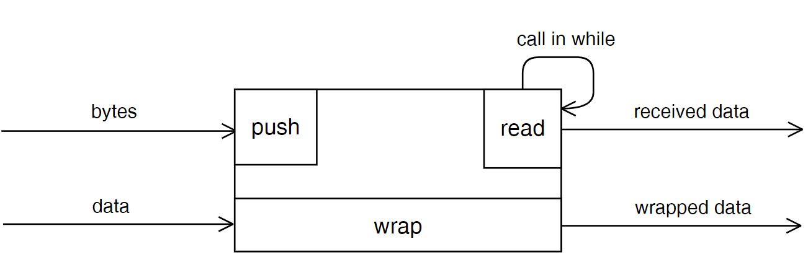

# Sheller integrity guarantee
To run tests with your device, use [ShellerTerminal](https://github.com/VNovytskyi/ShellerTerminal)
<p align="center">
  
</p>

## Overview
Library design for organization package data exchange with  integrity guarantee.
The package consists of Start-byte, a label for begin parsing 
package and several bytes of Cyclic redundancy check CRC-16 (CRC-byte) for integrity determination. <br>

Struct of package:

The library use CRC-16, therefore, the amount of CRC bytes is 2, and the maximum length of user data is 4095 bytes. 
Preset value of user data is 8 bytes. Eventually, 8 bytes useful bytes plus 3 service bytes. To speed up processing the CRC is using the table method.
The size of the CRC table is 512 bytes. Interaction with this library going through 3 functions: wrap, push, read:


## How to use
#### Init sheller
```c
#define SHELLER_DATA_LENGTH 8
sheller_t shell;
uint8_t receiveBuffer[SHELLER_DATA_LENGTH];
```
#### In main loop call read
```c
while (1) {
  if (sheller_read(&shell, receiveBuffer) == SHELLER_OK) {
    handleMessage(receiveBuffer, SHELLER_DATA_LENGTH);
  }
}
```
#### When receiving new byte
```c
sheller_push(&shell, receivedByte);
```
#### To send a message
```c
uint8_t transmitMessage[SHELLER_DATA_LENGTH];
uint8_t transmitBuffer[SHELLER_DATA_LENGTH + SHELLER_SERVICE_BYTES_COUNT];

transmitMessage[0] = 12;
transmitMessage[1] = 54;
transmitMessage[2] = 221;
sheller_wrap(&shell, transmitMessage, 3, transmitBuffer);
//Send (transmitBuffer, SHELLER_DATA_LENGTH + SHELLER_SERVICE_BYTES_COUNT)
```
#### Deinit sheller
```c
sheller_deinit(shell);
```
## Functions description
The Sheller object is initialized by the function:
```c
uint8_t sheller_init(sheller_t *desc, uint8_t start_byte, uint8_t usefull_data_length, uint16_t rx_buff_length);
```
The function is passed a pointer to the sheller object, the value of the start byte, the maximum amount of information in the packet, the size of the receive buffer.<br>
To create the package, the user needs to pass in function wrap a pointer of the sheller`s object, a pointer to data, which needs to send, the length of data, and a pointer to the buffer for storing the package.
```c
uint8_t sheller_wrap(sheller_t *desc, uint8_t *data, const uint8_t data_length, uint8_t *dest);
```
The length of the user`s data must be equal or less than SHELLER_USEFULL_DATA_LENGTH, otherwise, the function wrap returns false and creating the package will be failed. <br>
The size of the buffer to storing package declared by SHELLER_PACKAGE_LENGTH. Preset this value is 8 + 3 = 11. The created package is already ready to send via channel after call function wrap. The packet size does not depend on the length of user data and has a constant length SHELLER_PACKAGE_LENGTH. <br>
On receive side the package receiving byte by byte. Received bytes push into Sheller by calling function push:
```c
uint8_t sheller_push(sheller_t *desc, const uint8_t byte);
```
In this function pass a pointer of the Sheller`s object and received byte via channel. The function returns the result of pushing byte to an internal circular buffer. If overflow occurs therefore the function returns false.<br>
In the main loop of the program need to call non-blocking function read as often as possible to prevent buffer overflow:
```c
uint8_t sheller_read(sheller_t *desc, uint8_t *dest);
```
In this function pass a pointer of the Sheller`s object and a pointer to the buffer for the received package. Calling the function read starts the process of parsing the package from an internal circular buffer. The function returns true in case successful reading the package otherwise – false.<br>
The size of circular internal buffer defined by SHELLER_RX_BUFF_LENGTH.<br>
Buffer overflow can occur due to frequent call the push function and rare call the function read or too high frequency of receiving bytes and too small size of internal buffer SHELLER_RX_BUFF_LENGTH.<br>
To free allocated memory call the function:
```c
uint8_t sheller_deinit(sheller_t *desc);
```
In this function pass a pointer of the Sheller`s object.


## Internal logic

Sheller assumes work in communication channels with a high influence of interference. Functioning under such conditions is achieved by a State-machine, which is used for byte-by-byte data reception and a checksum algorithm. <br>

## Test cases
The illustration below shows examples of the effect of interference on transmitted packets:

In the <b>1</b> case, the package reached the recipient without damage.<br>
The <b>2</b> case demonstrates that Sheller does not impose restrictions on the transmitted data. The user data may contain service bytes.<br>
In the <b>3</b> case, the interference changed the value of the second byte. As a result, the checksum was not converged on the receiving side and the packet was not transferred to the business logic.<br>
In the <b>4</b> case, part of the package was lost due to interference or lack of contact. The checksum did not agree on the receiving side. In this case, a search was performed for the next initial byte, followed by the similarity of the checksum and the transfer of the packet to the business logic of the application.<br> 
In the <b>5</b>  test shows that the read function can be called over a circular buffer if there is a partially received packet
